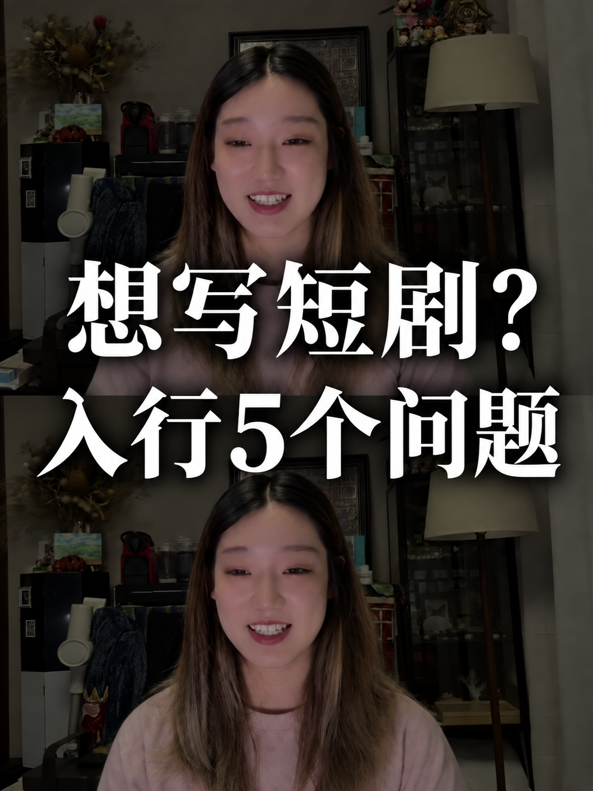

# 双图封面：视觉参考与执行要点

采用本技能默认风格时，先直接查看下方成图，再处理本次底图。图片是作者明确同意随技能公开的排版参考；只参考构图、字形、层级和暗度，不能把图中人物、背景或标题复制到其他用户的作品里。

这是一张平面参考图，不能从它推定精确字体名称、字号或真实图层参数。它不是必须套用的题材、标题或人物素材；用户本次给定的参考优先。

## 先裁出合格的半幅，再复制

1080×1440 封面的每个半幅为 1080×720，也就是 **3:2 横向区域**。原视频是 4:3、3:4 或 9:16，都需要为这个区域单独取景。

- **围绕人物选裁切框**：保留完整头部、下巴、肩部和必要环境；减少无信息的天花板、空墙。让脸在半幅里清楚可辨，而不是把一张竖图从几何中心截下来就算完成。
- 先看一张不加字的半幅：眼睛和嘴不能贴着下边缘，不能保留大块空墙却裁掉下巴。头部和肩部没有容纳下时，先调整裁切或换候选帧。
- 一般优先选择目光自然、睁眼、脸部清晰的帧；不要仅因“这一帧没有闭眼”就忽略夸张口型、运动模糊或过多遮挡。
- 需要更宽视野时，回到对应原素材选帧；原片没有的信息不能靠裁切凭空恢复，也不要补画身体。素材确实无法满足头肩构图时，说明限制并按用户允许的布局适配。
- 半幅取景合格后，再复制为上下两份。两份采用同一张图、同一裁切、同一缩放与调色，不分别猜位置。

## 封面短句与发布标题分开

封面负责让人一眼看懂主题，详细时间、经历和背景可放到发布标题或正文。不是把一整句发布标题断成两行就能用作封面。

授权 AI 提炼时，优先尝试每行约 4—7 个汉字量级的两句短语；数字、标点和字体都会影响宽度，这只是起点。先保证语义真实，再调整长短，不能为凑字数改变承诺。

例如，内容确实讲到如何收到第一单时，可以用“海外短剧／第一单怎么来？”作为封面短句，而把“离职后，靠写海外短剧剧本接到第一单”留给发布标题。这只是表达示范，不是新素材的固定文案。

用户已经锁定长标题时，不擅自删改；先尝试合理分行与自然字号。确实无法兼顾可读性时指出具体冲突，不把文字压扁、拉宽或缩成一条细线。

## 字体、标题区和照片共同安排

- 参考的是**有力度的宋体／明体字形**：粗竖、细横、清晰纯白。仅找到一个叫“宋体”的字体，不代表字重和字形已经匹配；没有同款字体时选接近的可用字形，并看真实渲染效果。
- 两行形成同一个标题块，居中跨越接缝；主标题应比背景更先被看到。可从每行约占画布宽 80%—90% 开始，但不要为填满行宽强行拉伸或使两行字号悬殊。
- 第一行优先落在上半幅人物的下方或肩胸区域，避开眼睛、鼻子和嘴；第二行结合下半幅人物位置安排，不能因为“居中”就挡住关键五官。标题与人物冲突时，同时复核裁切、短句长度和文字位置。
- 照片整体压暗，包括脸、衣服和环境，文字保持纯白。底图已经偏暗时不要机械重复叠加黑色蒙版。
- 投影要柔和、轻微向下，作用是把白字与背景分开。出现清晰错位的黑色字轮廓、厚硬描边或立体字效果时，应降低偏移与强度、柔化边缘；不是黑影越重越醒目。

## 制作工具与视觉检查

生成式图片编辑和确定性排版都需要上述构图判断。使用宿主允许且实际可用的方式；不能因为某个工具能精确放字，就认定设计已经通过。

Pillow 等确定性工具适合按明确的裁切框和文字布局执行；缺少视觉参考、字体选择或正确裁切时，代码同样会稳定地产生错误排版。生成式工具要检查身份、字形和上下取景漂移，不能将其结果称为无损复刻。

交付前做两种实际查看：

1. **原尺寸检查**：文字和标点正确，上下人物一致，头肩裁切完整，五官无遮挡，没有文字变形或硬阴影。
2. **手机缩略图检查**：把参考图和新成图按同样宽度缩小显示，例如约 270px 宽，模拟信息流小图。在不放大的情况下，能否迅速读出两行主题、辨认人物；标题是否仍是第一视觉重点。270px 是检查用尺寸，不是平台规格。

缩小显示可以用图片查看器或浏览器，不必改写原图。不能仅靠读取分辨率、OCR 识别成功或确认“有双图、有宋体”代替实际视觉检查。若当前工具不能查看图片，应说明视觉未验证。

**发现以下问题就针对性修正后再交付**：留大片天花板却切掉下巴／肩部；一行长句导致字过小；字压住嘴眼；两行字体力度失衡；投影像错位黑字；缩小后只能看到背景而读不清主题。无需凑多个版本，但不能把存在这些问题的首版直接当成完稿。
